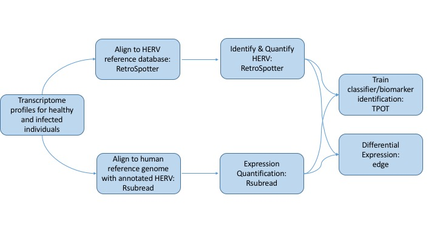

# CHERVIL
Computational Human Endogenous RetroViral Infection Landscape is a pipeline and analytical tool for detection of endogenous retroviral expression features that correspond to current or previous viral infection. 

## What is CHERVIL and why do we need it?
Human endogenous retroviral elements (HERVs) are retroviruses that have integrated themselves into the human germline. Usually, they remain latent in the human genome. However, previous work suggests that some HERVs become actively transcribed upon viral infection. CHERVIL uses differential expression analysis of HERVs in healthy and infected popuations via RNA-seq in  to detect pre-symptomatic or historic viral infection. 

CHERVIL builds on an exisiting pipelines built for HERV detection (RetroSpotter) and adds on a machine learning component to identify patterns in HERV expression specific to distinct viral infections. 

## Overview Diagram of Workflow

### RetroSpotter Plus
* Utilize RetroSpotter to identify differentially expressed hERVs in infected populations 
    + Supply SRA accession numbers for expression dataset of healthy and infection of interest
   
* Apply Machine Learning Algorithm to identify classifiers of hERVS specific to viral infection
    
### Novel Pipeline
* Create new pipeline for RNAseq analysis using Rsubread 
    + Supply SRA accession numbers for expression dataset of healthy and infection of interest
    
* Apply machine learning to identify patterns of HERV expression specific to viral infection

### Example Dataset
* PRJNA349748: Human Tracheobronchial Epithelial (HTBE) cells infected with Influenza
    + Data Type: RNA-seq
    + Conditions / Samples: H1N1, H5N1, H3N2, mock-infected controls
* PRJNA429171: HuH7 cells infected with Ebola and Marburg Virus
    + Data Type: RNA-seq
    + Conditions / Samples: Ebola, Margburg, mock-infected controls
    

## How to use chervil

## Software Workflow Diagram

## File Structure Diagram

## Install Instructions

