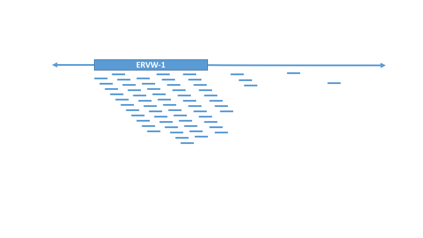

# CHERVIL

Computational Human Endogenous RetroViral Infection Landscape is a pipeline and analytical tool for detection of endogenous retroviral expression features that correspond to current or previous viral infection.

## What is CHERVIL and why do we need it?
Human endogenous retroviral elements (HERVs) are retroviruses that have integrated themselves into the human germline. Usually, they remain latent in the human genome. However, previous work suggests that some HERVs become actively transcribed upon viral infection. CHERVIL uses differential expression analysis of HERVs in healthy and infected populations via RNA-seq in  to detect pre-symptomatic or historic viral infection.

CHERVIL builds on an existing pipeline built for HERV detection [RetroSpotter](https://github.com/NCBI-Hackathons/RetroSpotter) and adds on a machine learning component to identify patterns in HERV expression specific to distinct viral infections.

## Overview Diagram of Workflow

### RetroSpotter Plus
* Utilize RetroSpotter to identify differentially expressed HERVs in infected populations
    + Supply SRA accession numbers for expression dataset of healthy and infection of interest samples
    + Supply database of HERV sequences of interest
* Generate HERV1 count dataframe
* Apply machine learning to identify HERV expression patterns specific to viral infection using [TPOT](https://github.com/EpistasisLab/tpot).

### Example Dataset
* PRJNA349748: Human Tracheobronchial Epithelial (HTBE) cells infected with Influenza
    + Data Type: RNA-seq
    + Conditions / Samples: H1N1, H5N1, H3N2, mock-infected controls
* PRJNA429171: HuH7 cells infected with Ebola and Marburg Virus
    + Data Type: RNA-seq
    + Conditions / Samples: Ebola, Marburg, mock-infected controls

## How to use CHERVIL

## Installation 
### Requirements
#### Software
#### Libraries

## Example Run
